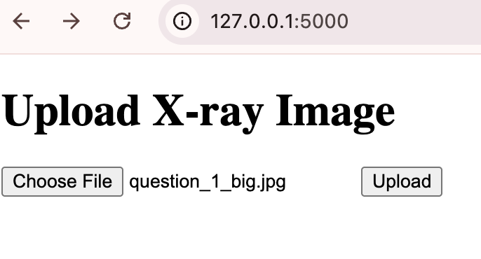
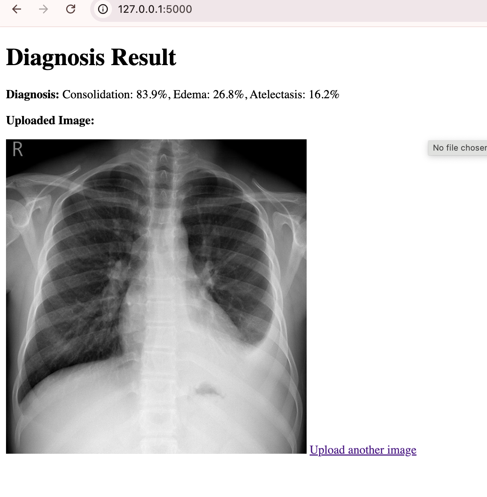

# XrayDiagnoseApp

XrayDiagnoseApp is a Flask web application for automated diagnosis of chest X-ray images using the CheXNet deep learning model. Users can upload X-ray images and receive predictions for common thoracic pathologies.

## Features

- Upload chest X-ray images via a simple web interface
- Automated diagnosis using a pre-trained CheXNet model
- Displays prediction probabilities for multiple conditions
- Shows uploaded image and diagnosis results

## Demo

### Homepage

 <!-- #file:homepage.png -->

### Diagnosis Result

 <!-- #file:resultimg.png -->

## Getting Started

### Prerequisites

- Python 3.7+
- [requirements.txt](requirements.txt) dependencies

### Installation

1. Clone the repository.
2. Install dependencies:
    ```sh
    pip install -r requirements.txt
    ```
3. Place the CheXNet model checkpoint (`chexnet_checkpoint.pth`) in the project directory.

### Running the App

```sh
python app.py
```

Visit [http://127.0.0.1:5000](http://127.0.0.1:5000) in your browser.

## Project Structure

- `app.py`: Main Flask application
- `chexnet_checkpoint.pth`: Pre-trained CheXNet model weights
- `templates/`: HTML templates for upload and result pages
- `uploads/`: Uploaded images
- `homepage.png`, `resultimg.png`: Demo screenshots

## License

This project is for